```{r setup, include=FALSE}
# xaringan::inf_mr()
options(htmltools.dir.version = FALSE)
knitr::opts_chunk$set(echo = TRUE, eval = TRUE)
library(tidyverse)
library(rlang)
library(knitr)
set.seed(78987)
```


class: center
background-image: url(images/gt_logo.png)
background-size: contain

# {gt} package

???
- gt is the grammar of graphics

- package from Rstudio

- seeks to create a unifying code base for HTML, PDF, and RTF output

- HTML and PDF are great. RTF is getting close
---
# {gt} philosophy
.large[
"We can construct a wide variety of useful tables with a cohesive set of table parts. These include the *table header*, the *stub*, the *stub head*, the *column labels*, the *table body*, and the *table footer*."
]
<p align="center">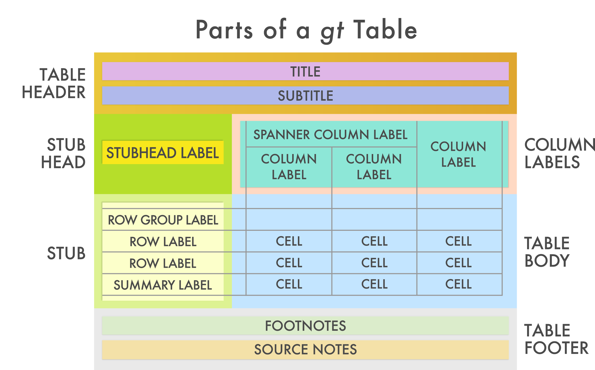</p>

???

- package has sets of functions for modifying each piece of a table

- we'll review the most common/useful
---
# {gt} installation

.large[
- {gt} is not yet released on CRAN.

- Use the code below to install from GitHub.
]
```{r, eval=FALSE}
remotes::install_github("rstudio/gt")
```

.large[
- While you're at it, install {gtsummary} as well.
]
```{r, eval=FALSE}
remotes::install_github("ddsjoberg/gtsummary")
```

.large[
- There is a version of {gtsummary} on CRAN, but with limited functionality.

- Will be released on CRAN after {gt} is released.
]
---
# {gt} examples: the data

.large[When used alone, the `gt()` function prints a data frame. But so much more is possible!]

.pull-left[
```{r, results=FALSE}
library(gt)
# loading gtsummary for the data
library(gtsummary)
gt_trial_head <- head(trial) %>%
  gt() #<<
```
```{r, include=FALSE}
# gtsave(gt_trial_head, "images/gt_trial_head.png")
```

<p align="center">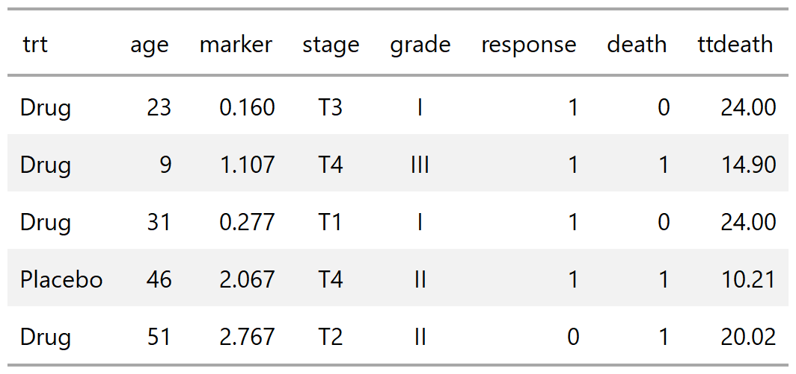</p>
]

.pull-right[
```{r, results=FALSE, echo=FALSE}
gt_trial_info <- tibble(
  variable = names(trial),
  class = map(variable, ~class(trial[[.x]])),
  label = map(variable, ~attr(trial[[.x]], "label"))
) %>%
  gt() #<<
```
```{r, include=FALSE}
# gtsave(gt_trial_info, "images/gt_trial_info.png")
```

<p align="center">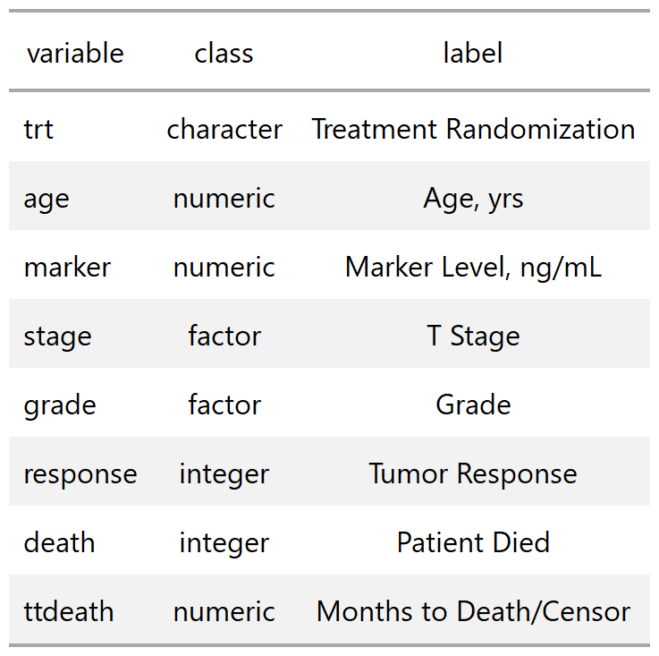</p>
]

???
- the most common and useful is gt()

- gt() is the first function to run, required every time
---
# {gt} examples: the viewer

.large[
- {gt} tables print to the RStudio viewer when in the global environment.
]
<p align="center">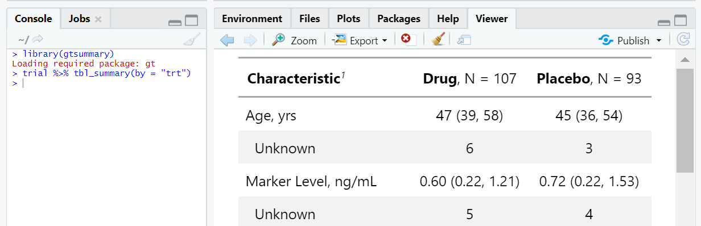</p>

.large[
- {gt} tables also print in R markdown documents (HTML, PDF, RTF), Shiny apps, etc.
]

???
Note that Word Document is NOT an output type.  Word can, however, read RTF documents.
---
# {gt} examples: formatting columns

```{r, results=FALSE}
trial_summary <- trial %>% group_by(trt) %>% summarise_at(vars(age, marker), mean, na.rm = TRUE)
```

.pull-left[

### Raw Summary Statistics

```{r, results=FALSE}
gt_print <- 
  gt(trial_summary) #<<
```
```{r, include=FALSE}
# gtsave(gt_print, "images/gt_print.png")
```

<p align="center">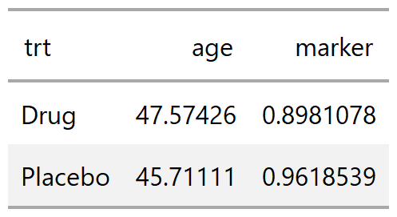</p>
]

.pull-right[
### Formatted Summary Statistics

```{r}
gt_format <-
  gt(trial_summary) %>%  
  fmt_number(columns = vars(age), #<<
             decimals = 0) %>%    #<<
  fmt_number(columns = vars(marker),    #<<
             decimals = 2)    #<<
```
```{r, include=FALSE}
# gtsave(gt_format, "images/gt_format.png")
```

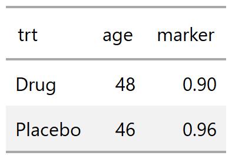</p>
]

.bottom[.large[Each column can be formatted without creating a character version of the column!]]

???

- Remember this trial_summary object.  We're using it for the next few slides

- the raw print is not pretty

- we can add formatting, here we format columns with `fmt_number()`

- we don't have to create character versions of our columns!  wonderful!

- use `vars()` because we can seletct mutliple columns.  Also accepts character vector of names

---
# {gt} examples: formatting cells

```{r, results = FALSE}
gt_fmt_cell <- trial_summary %>%
  gather("variable", "mean", -trt) %>%
  gt() %>%  #<<
  fmt_number(columns = vars(mean), rows = variable == "age", decimals = 0) %>% #<<
  fmt_number(columns = vars(mean), rows = variable == "marker", decimals = 2) #<<
```
```{r, include=FALSE}
# gtsave(gt_fmt_cell, "images/gt_fmt_cell.png")
```
.pull-left[
<p align="center">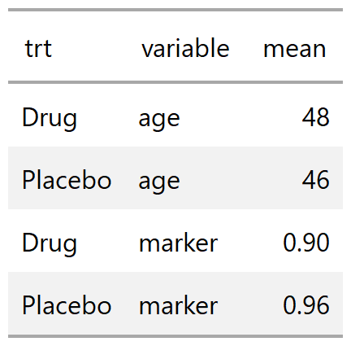</p>
]

.pull-right[.large[
- Use the `rows = ` argument to pinpoint a cell to format.

- There are many formatting functions available: `fmt_percent()`, `fmt_currency()`, `fmt_date()`, `fmt_time()`, `fmt_missing()`, and more.

- You can write your own function and pass it to `fmt()` to format a table.
]]

???

- the `fmt_number()` function can also used to format a single cell

- lots of formatting functions to choose from

---
# {gt} examples: grouping data

```{r, results = FALSE}
gt_group <- trial_summary %>%
  gather("variable", "mean", -trt) %>%
  gt(groupname_col = "trt") %>%  #<<
  fmt_number(columns = vars(mean), rows = variable == "age", decimals = 0) %>% 
  fmt_number(columns = vars(mean), rows = variable == "marker", decimals = 2)
```
```{r, include=FALSE}
# gtsave(gt_group, "images/gt_group.png")
```
.pull-left[
<p align="center">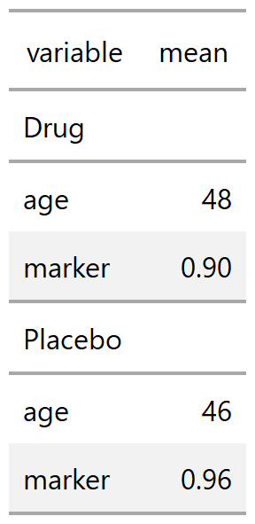</p>
]

.pull-right[.large[
- Use the `groupname_col = ` argument to specify a column to group results.

- The grouping column is not printed and a stub row for each group is added.
]]

---
# {gt} examples: column formatting

```{r, results = FALSE}
gt_cols <- trial_summary %>%
  gt() %>%  
  fmt_number(columns = vars(age), decimals = 0) %>% 
  fmt_number(columns = vars(marker), decimals = 2) %>%
  cols_label(trt = md("**Treatment**"), age = md("**Age**"), marker = md("**Marker**")) %>% #<<
  tab_spanner(label = "Patient Characteristics", columns = vars(age, marker)) #<<
```
```{r, include=FALSE}
# gtsave(gt_cols, "images/gt_cols.png")
```
.pull-left[
<p align="center">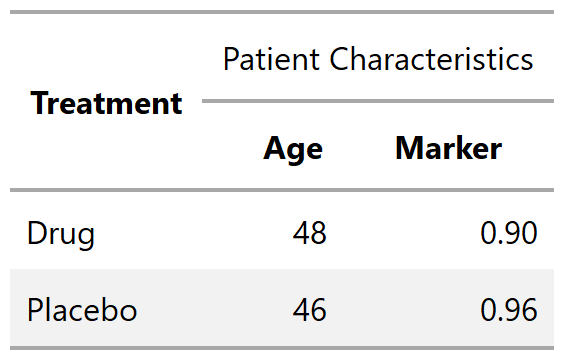</p>
]

.pull-right[.large[
- The `cols_label()` function modifies the column headers.

- The `tab_spanner()` function includes a spanning header row.

- The `md()` function interprets input text as Markdown (see also `html()`).
]]

---
# {gt} examples: titles & footnotes

```{r, results = FALSE}
gt_title_footnote <- trial_summary %>%
  gt() %>%  
  fmt_number(columns = vars(age), decimals = 0) %>% 
  fmt_number(columns = vars(marker), decimals = 2) %>%
  cols_label(trt = md("**Treatment**"), age = md("**Age**"), marker = md("**Marker**")) %>%
  tab_header(title = "Patient Characteristics", subtitle = "Presented by treatment") %>%  #<<
  tab_footnote(footnote = "Statistic presented is the mean.",  #<<
               locations = cells_column_labels(columns = vars(age, marker)))   #<<
```
```{r, include=FALSE}
# gtsave(gt_title_footnote, filename = "images/gt_title_footnote.png")
```
.pull-left[
<p align="center">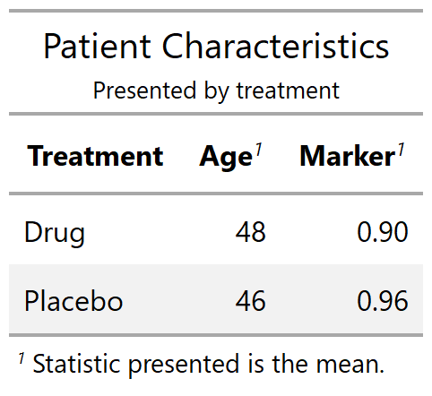</p>
]

.pull-right[.large[
- It's easy to include titles, subtitles, footnotes, and source notes in {gt} tables.

- The footnotes are automatically numbered based on where they appear in the table.
]]

---
class: center
background-image: url(images/gt_functions.svg)
background-size: contain

# much much more {gt} to learn

---
class: center
# {gtsummary}

TRANSITION SLIDE TO {gtsummary}

---
# {gtsummary} introduction

```{r, eval=FALSE, include=FALSE}
DiagrammeR::grViz("digraph flowchart {
      # node definitions with substituted label text
      node [fontname = Helvetica, shape = oval, color = grey50]
      tab1 [label = '@@1']
      tab2 [label = '@@2']
      tab3 [label = '@@3']
      tab4 [label = '@@4']

      # edge definitions with the node IDs
      tab1 -> tab2 [dir = back];
      tab1 -> tab3 [dir = back];
      tab1 -> tab4 [dir = back]
      }

      [1]: '{biostatR} v1.0 (unreleased)'
      [2]: '{gtsummary}'
      [3]: '{mskRutils}'
      [4]: '{mskRvis}'
") 
```

<p align="center"></p>

.large[
- {gtsummary} will soon be a part of the biostatR-verse of packages.

- The package uses {gt} as its back end to create tables.

- Used to summarize data frames, regression models, and more.

- Has a tidy API, sensible defaults (meaning minimal code), and is highly customizable.
]

???

- some functions from biostatR v0.1 have been exported to mskR

- mskR and biostatR are both undergoing an uncoupling.

- biostatR will comprise of these three packages

- biostatR won't fully undergo the uncoupling until {gt} is released (or their RTF output is improved)
---
# {gtsummary} summarize data with tbl_summary()

.large[Let's review the data once more]

.pull-left[
<p align="center"></p>
]
.pull-right[
.large[For brevity, we'll use an abbreviated version of the trial data set with fewer columns.]

```{r}
sm_trial <-
  trial %>%
  select(trt, age, response, grade)
```
]

---
# {gtsummary} summarize data with tbl_summary()

.pull-left[
```{r, results = FALSE}
tbl_summary_1 <-
  tbl_summary(sm_trial, by = "trt") #<<
```
```{r, include=FALSE}
# gtsave(tbl_summary_1 %>% as_gt(), filename = "images/tbl_summary_1.png")
```
.large[
- Default statistics are median (IQR) for continuous variables, and n (percent) for categorical data.

- By default, variables coded as 0/1, TRUE/FALSE, and Yes/No are presented dichotomously.
]
]
.pull-right[
<p align="center">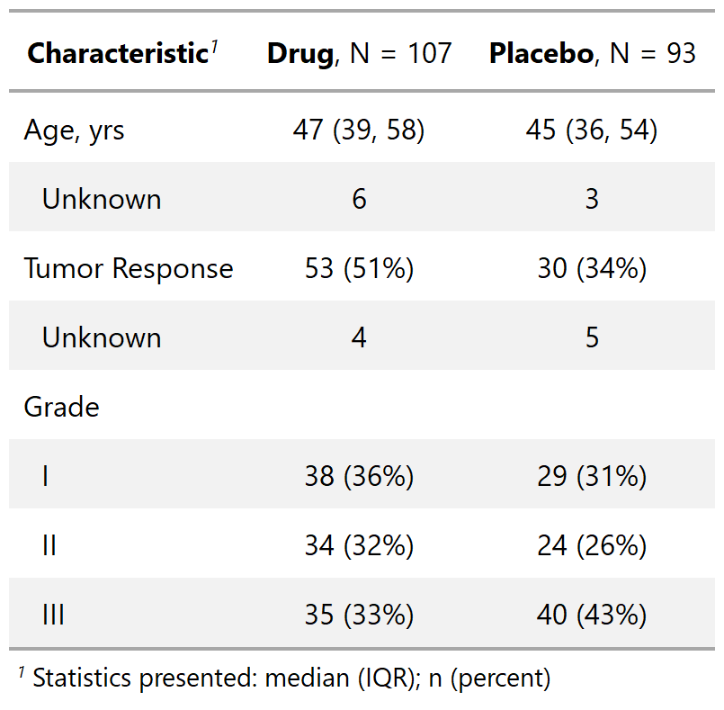</p>
]

???

- just one line of code

- this is how i used the function 95% percent of the time...so easy

- three types of data shown here (explain them)

---
# {gtsummary} summarize data with tbl_summary()

.pull-left[
```{r, results = FALSE}
tbl_summary_2 <-
  tbl_summary(sm_trial, by = "trt") %>%
  add_p() #<<
```
```{r, include=FALSE}
# gtsave(tbl_summary_2 %>% as_gt(), filename = "images/tbl_summary_2.png")
```
.large[
- To compare values across two or more groups, use the `add_p()` function.

- The default tests are the Wilcoxon rank-sum test for continuous variables, chi-square test of independence for most categorical data, and Fisher's exact test for categorical data with low expected counts.
]
]
.pull-right[
<p align="center">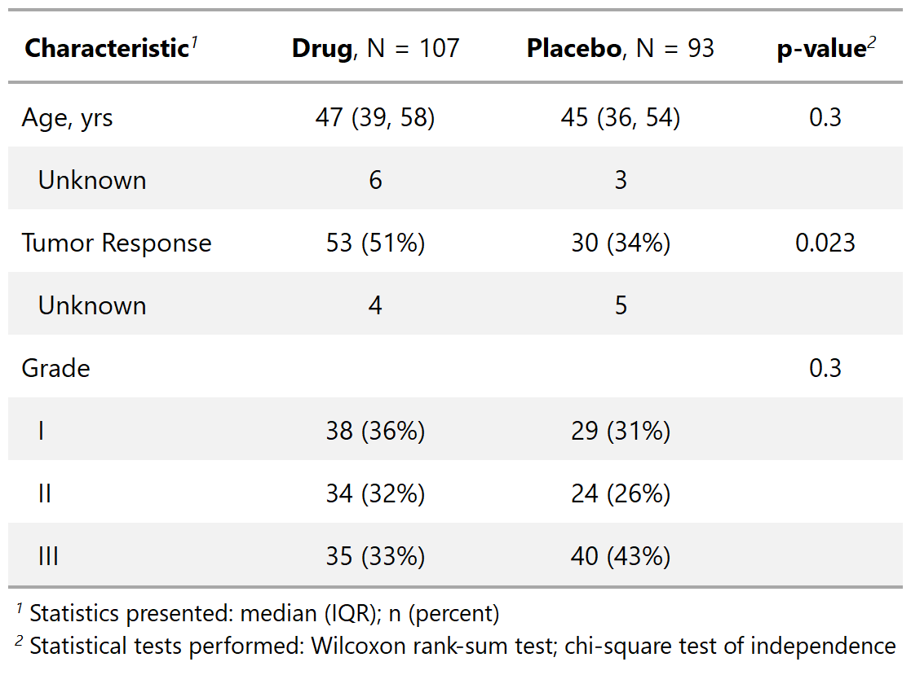</p>
]

???

- add_p account for another 4% of how I use the function

- explain the test defaults

    - other options
    - 2 or more groups
    - random effects for correlated data

---
# {gtsummary} and the {glue} package

.large[
- {glue} is similar to paste (but I like it so much more).

- To use, embed R expressions in curly braces. 

- They are then evaluated and inserted into the argument string.
]
```{r}
x = 1
name = "Daniel"
glue::glue("{name} is number {x}") #<<
```

.large[
- Expression can be complex.
]
```{r}
glue::glue("{name} is number {((x + 100) * 10) - 1009}") #<<
```

---
# {gtsummary} summarize data with tbl_summary()

.pull-left[
```{r, results = FALSE}
tbl_summary_3 <- sm_trial %>%
  tbl_summary(
    by = "trt",
    statistic = list( #<<
      all_continuous() ~ "{mean} ({sd})", #<<
      all_categorical() ~ "{n} / {N} ({p}%)" #<<
    ), #<<
    label = vars(age) ~ "Patient Age" #<<
  ) %>%
  add_p(test = all_continuous() ~ "t.test") #<<
```
```{r, include=FALSE}
# gtsave(tbl_summary_3 %>% as_gt(), filename = "images/tbl_summary_3.png")
```
.large[
- Report mean and standard deviation for continuous variables.

- Specify label for age variable.

- Report p-values from the t-test.
]
]
.pull-right[
<p align="center">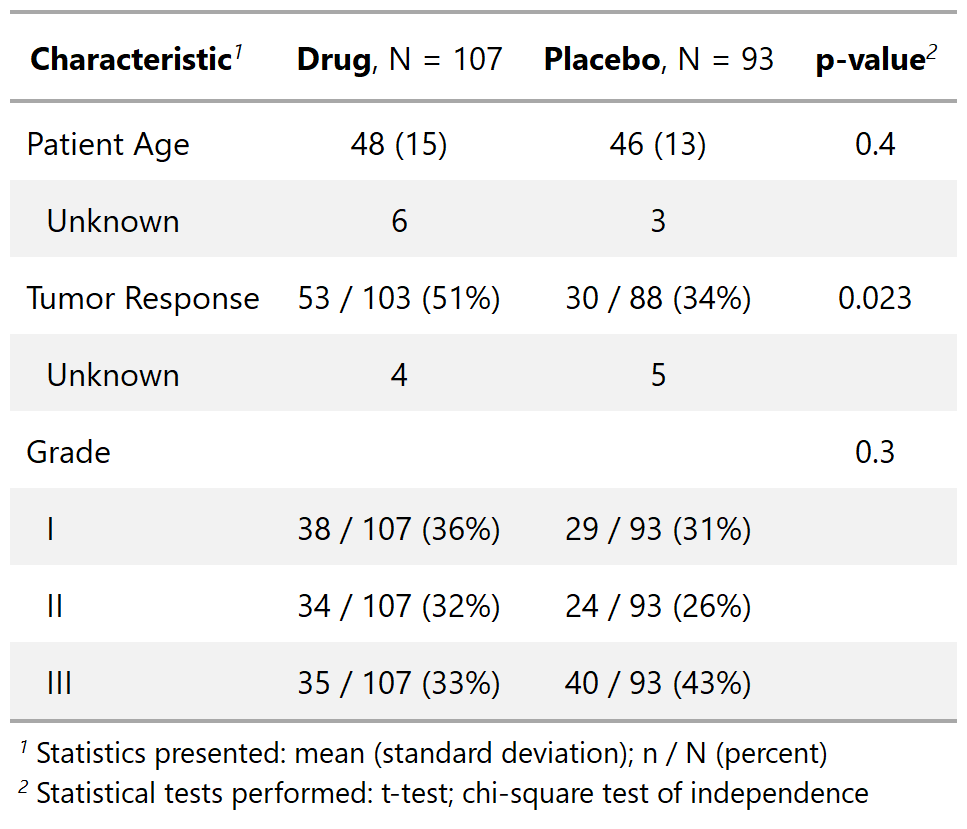</p>
]

???

- discuss the glue package and how it works and how it's utilized all over {gtsummary}.  Maybe even add a slide about it?

- the defaults are in a word, perfect (for me), but you may want to change them

- statistics can be changed to anything...literally any R function

- discuss the formula notation
    - it's like `case_when()`, condition/variable on LHS and result on RHS

- the vignette has examples with more examples
---
# {gtsummary} summarize data with tbl_summary()

.pull-left[
```{r, results = FALSE}
tbl_summary_4 <- sm_trial %>%
  tbl_summary(
    by = "trt",
    type = "response" ~ "categorical",  #<<
    statistic = all_continuous() ~ "{mean} ({sd})",
    digits = vars(age) ~ c(0, 1)  #<<
  ) %>%
  add_p(test = all_continuous() ~ "t.test") %>%
  add_stat_label()  #<<
```
```{r, include=FALSE}
# gtsave(tbl_summary_4 %>% as_gt(), filename = "images/tbl_summary_4.png")
```
.large[
- Report all levels for the response variable.

- Modify the default rounding for age.

- Add column indicating statistics presented.
]
]
.pull-right[
<p align="center">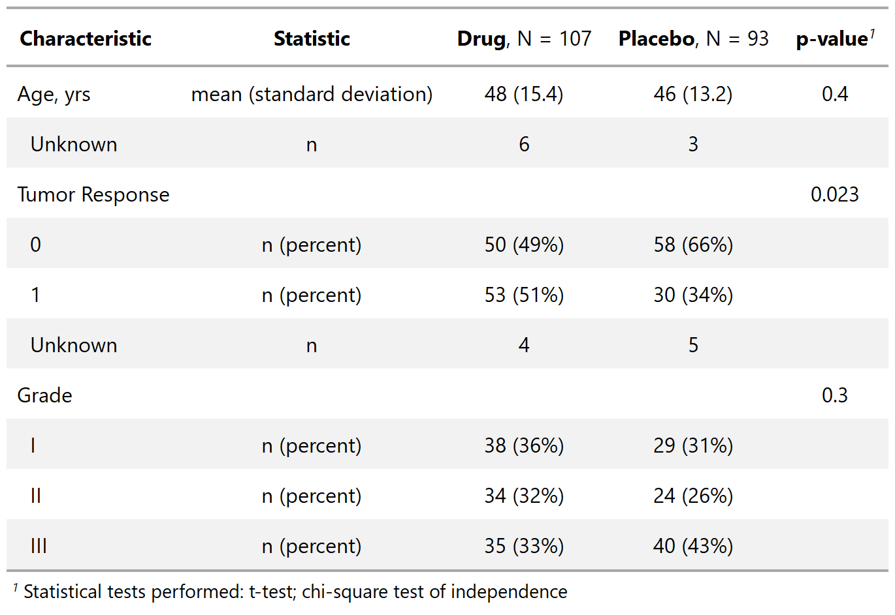</p>
]

???

- further discuss formula notation

- discuss digits and how it's used

- discuss stat_label, and mention the footnote was omitted

---
# {gtsummary} summarize data with tbl_summary()

.large[Advanced Customization

- It's natural a {gtsummary} package user would want to customize the aesthetics of the table with one or more of the many {gt} functions available.  

- Every function in {gt} is available to use with a {gtsummary} object.

1. Create a {gtsummary} table.

1. Convert the table to a {gt} object with the `as_gt()` function.

1. Continue formatting as a {gt} table with any {gt} function.
]

---
# {gtsummary} summarize data with tbl_summary()


.pull-left[
.large[Advanced Customization]

```{r, results = FALSE}
tbl_summary_5 <- sm_trial %>%
  tbl_summary(by = "trt") %>%
  # convert from gtsummary object to gt object
  as_gt() %>% #<<
  # modify with gt functions
  tab_spanner(  #<<
    label = "Randomization Group",   #<<
    columns = starts_with("stat_")  #<<
  )  #<<
```
```{r, include=FALSE}
# gtsave(tbl_summary_5, filename = "images/tbl_summary_5.png")
```

.footnote[More on this in the `tbl_summary()` vignette]
]
.pull-right[
<p align="center">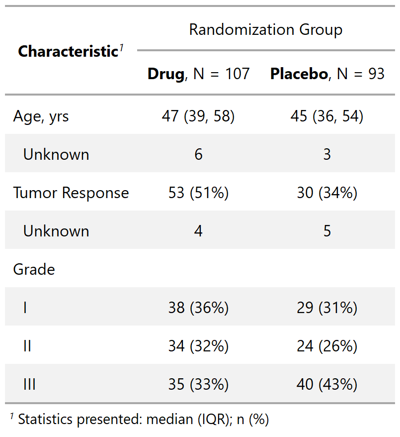</p>
]
---
class: left
# {gtsummary} summarize data with tbl_summary()

.large[
Review the tbl_summary vignette for more details
http://www.danieldsjoberg.com/gtsummary/articles/tbl_summary.html
]

.pull-left[.large[
- Reporting any statistic for continuous variables, including user-written functions.

- More on dichotomous variables and how to specify the level printed.

- Missing data options (e.g. report as a column rather than a row, always report N missing even when no missing data, modify missing text, etc.).
]]
.pull-right[.large[
- Sort categorical variables by frequency.

- Report row percent, rather than column percent.

- Report q-values from various methods like false discovery rate.

- Sort data by ascending p-values when comparisons have been made.
]]

???

There is more that we are not covering here

---
# {gtsummary} summarize models with tbl_regression()

### Raw Outupt
```{r}
m1 <- glm(response ~ trt + grade + age, data = trial, family = binomial) #<<
m1
```

---
# {gtsummary} summarize models with tbl_regression()

### {broom} Outupt
```{r}
broom::tidy(m1, conf.int = TRUE, exponentiate = TRUE) #<<
```

---
# {gtsummary} summarize models with tbl_regression()

### {gtsummary} Outupt
```{r, results = FALSE}
tbl_regression_1 <- tbl_regression(m1, exponentiate = TRUE) #<<
```
```{r, include=FALSE}
# gtsave(tbl_regression_1 %>% as_gt(), filename = "images/tbl_regression_1.png")
```

.pull-left[.large[
- `tbl_regression()` accepts regression model object as inputs.

- Reference groups added to the table.

- Logistic regression model with odds ratio header and footnote.
]]

.pull-right[
<p align="center">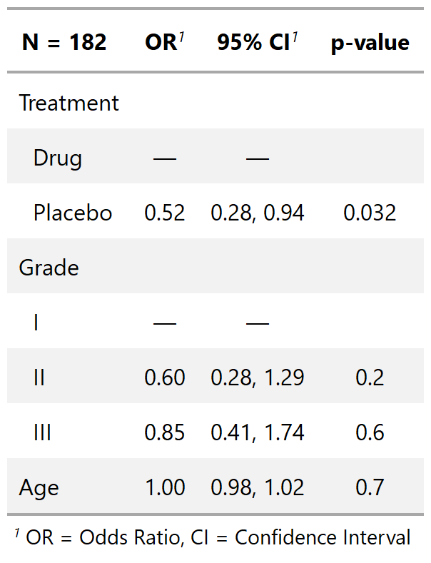</p>
]
???
- This table is ready for publication!

- That is something no other package I know of can do

- The back end for the function is {broom} and {gt}, meaning that there is broad support for most regression model types, and the resulting tables are gorgeous and customizable.

- Common regression models, such as logistic regression and Cox regression, are automatically identified and the tables are created with appropriate headers. 

- Resulting tables can be merged (i.e. side-by-side tables for models with the same predictors and different outcomes).  

- Tables can also be stacked on top of one another.

- build the regression model on your own....we are not in the business of model estimation or checking

---
# {gtsummary} summarize models with tbl_regression()

.pull-left[
```{r, results = FALSE}
tbl_regression_2 <- m1 %>%
  tbl_regression(exponentiate = TRUE) %>%
  add_global_p() #<<
```
```{r, include=FALSE}
# gtsave(tbl_regression_2 %>% as_gt(), filename = "images/tbl_regression_2.png")
```
.large[
- Replace individual p-values for categorical variables with global p-value for the entire variable.
]
]
.pull-right[
<p align="center">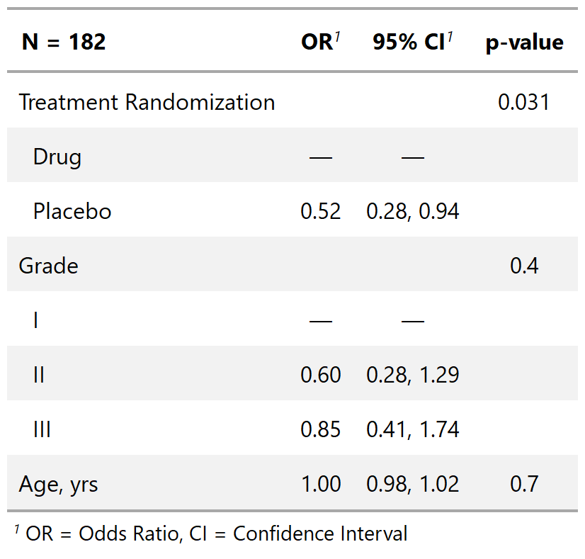</p>
]

???

Thank you to Stefania for suggesting an improved name change for `add_global_p()`!

---
# {gtsummary} summarize models with tbl_regression()

.pull-left[
```{r, results = FALSE}
library(survival)
tbl_regression_3 <- 
  coxph(Surv(ttdeath, death) ~ trt + grade + age, 
        data = trial) %>%
  tbl_regression(exponentiate = TRUE)
tbl_regression_4 <-
  tbl_merge( #<<
    tbls = list(tbl_regression_1, tbl_regression_3), #<<
    tab_spanner = c("Tumor Response", "Time to Death") #<<
  ) #<< 
```
```{r, include=FALSE}
# gtsave(tbl_regression_4 %>% as_gt(), filename = "images/tbl_regression_4.png")
```
.large[
- Build Cox regression model with same predictors as previous model.

- Merge the two regression models with the same predictors and present results side-by-side.
]
]
.pull-right[
<p align="center">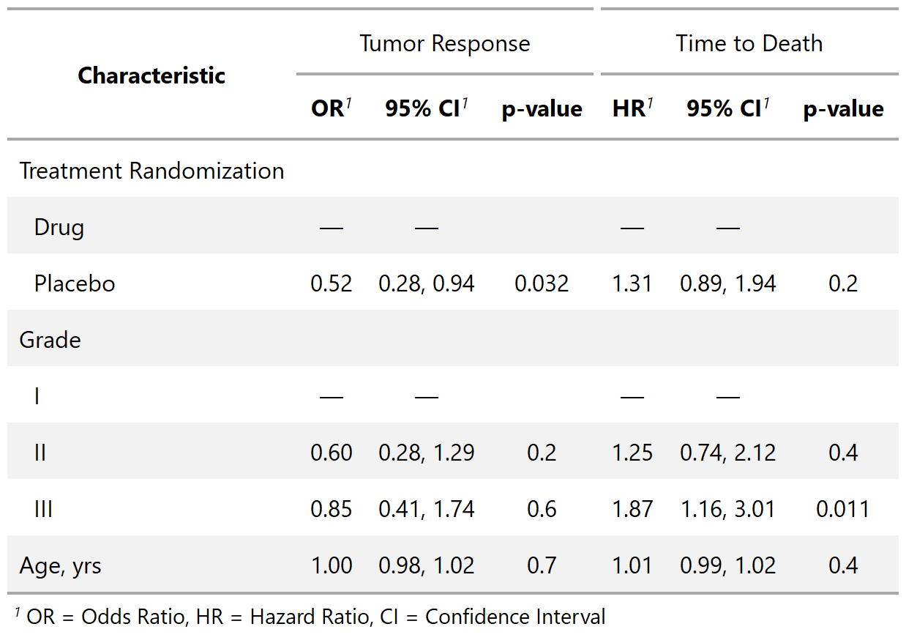</p>
]

???

- side-by-side regression results is common in cancer research (e.g. time to recurrence, then time to death)

- stacking two or more models is also possible
---
# {gtsummary} summarize data with tbl_uvregression()

.pull-left[
```{r, results = FALSE}
library(survival)
tbl_uvregression_1 <- 
  tbl_uvregression( #<<
    sm_trial, #<<
    method = glm, #<<
    y = response, #<<
    method.args = list(family = binomial), #<<
    exponentiate = TRUE #<<
  ) #<<
```
```{r, include=FALSE}
# gtsave(tbl_uvregression_1 %>% as_gt(), filename = "images/tbl_uvregression_1.png")
```
.large[
- Table of univariate regression models.

- Specify the outcome, and the remaining variables in data frame serve as predictors.
]
]
.pull-right[
<p align="center">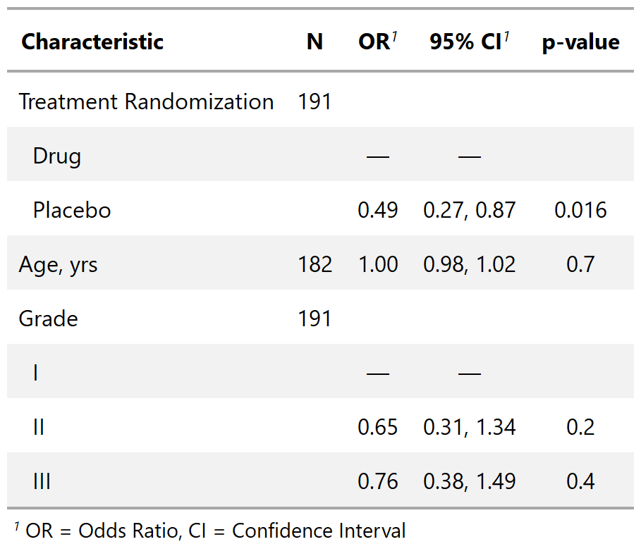</p>
]

???

Tables of univariate results can be good for exploratory analysis

---
# {gtsummary} summarize data with tbl_survival()
.pull-left[
```{r, plot-last-surv, fig.show = 'hide'}
fit1 <- survfit(Surv(ttdeath, death) ~ trt, #<<
                data = trial) #<<

survminer::ggsurvplot(
  fit = fit1, 
  xlab = "Months",
  ylab = "Overall survival probability",
  legend.title = "Treatment Group",
  legend.labs = c("Drug", "Placebo"),
  break.x.by = 6, 
  censor = FALSE,
  risk.table = TRUE,
  risk.table.y.text = FALSE
)
```
]

.pull-right[
```{r, ref.label = 'plot-last-surv', echo = FALSE}
```
]
---
# {gtsummary} summarize data with tbl_survival()

.pull-left[
```{r, results = FALSE}
tbl_survival_1 <- fit1 %>%
  tbl_survival(times = c(12, 24), #<<
               label = "{time} Month") #<<
```
```{r, include=FALSE}
# gtsave(tbl_survival_1 %>% as_gt(), filename = "images/tbl_survival_1.png")
```
.large[
- First, use `survfit()` to estimate survival times.

- Create table of estimates with `tbl_survival()`.

- Can use this function to print survival quantiles as well, e.g. median survival.
]
]
.pull-right[
<p align="center">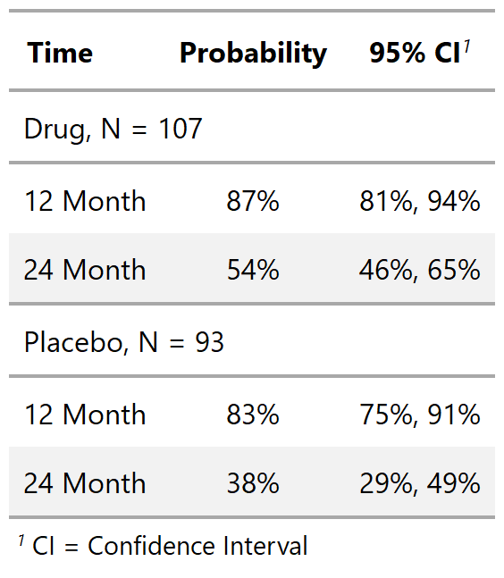</p>
]

---
# {gtsummary} reporting results with inline_text()
.large[
- Tables are important, but we often need to report results in-line in a report.

- Any statistic reported in a {gtsummary} table can be extracted and reported in-line in a R Markdown document with the `inline_text()` function.

```{r, comment=""}
inline_text(tbl_regression_1, variable = "trt", level = "Placebo")
```

- The pattern of what is reported can be modified with the `pattern = ` argument.  

- Default is `pattern = "{estimate} ({conf.level*100}% CI {conf.low}, {conf.high}; {p.value})"`.
]

???

- discuss importance of reproducible results

- data is constantly updating

- this functionality assures you won't miss updating a reported estimate in a document

- for me, this is one the most powerful parts of the {gtsummary} package

- something I've never seen in another package
---
class: center
# {gtsummary}
.large[
• Every function is documented further in the help file •

• Check out the package website for vignettes including detailed examples and explanations •

 {gt} package <a href="https://github.com/rstudio/gt">github.com/rstudio/gt</a>

 {gtsummary} package <a href="https://github.com/ddsjoberg/gtsummary">github.com/ddsjoberg/gtsummary</a>

 slides at <a href="http://www.danieldsjoberg.com/gt-and-gtsummary-presentation">danieldsjoberg.com/gt-and-gtsummary-presentation</a>  

 source code for slides at <a href="https://github.com/ddsjoberg/gt-and-gtsummary-presentation">github.com/ddsjoberg/gt-and-gtsummary-presentation</a>
]

???

Go star {gtsummary} on GitHub...we're already to 50+!

---
# {gtsummary} Advanced

.large[
{gtsummary} output is a list that prints as a {gt} table.
]
```{r}
names(tbl_summary_1)
```

.pull-left[
```{r}
pluck(tbl_summary_1, "table_body") %>% head()
```
]
.pull-right[
```{r}
pluck(tbl_summary_1, "gt_calls") %>% head(n = 4)
```
]

???

If there is time, review the structure of a {gtsummary} object

Essentially, what is going on is that the {gt} calls on the right are called on the table on the left whenever the object is printed.

Understanding this structure will help you modify if you need.  If there is a {gt} call that formats in a way you don't like, convert your object with `as_gt()` and use the `omit =` argument to leave out the gt call you don't like.

You can replace it with whatever you choose.
